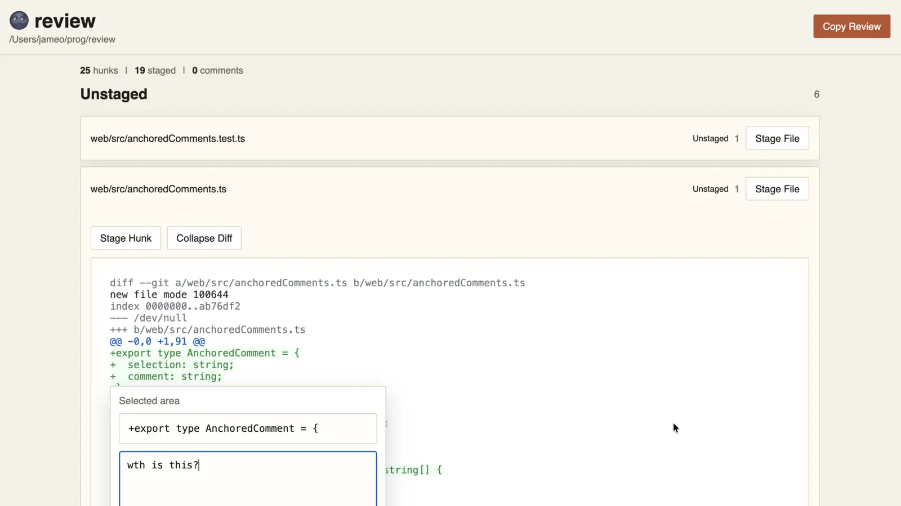

# 🌚 review (moonreview)



Tiny local code review UI for git.

It shows git hunks, lets you comment, stage or unstage them individually, and collect notes in one big copy-pasteable review block for efficient copy pasting in your favourite AI tool.

## Installation / Usage

```bash
cargo install --path .
moonreview
```

Run `moonreview` inside any git repository you want to review.

## Stopping the server

```bash
pkill moonreview
```

## Development

I usually use this as part of my debug loop:

```bash
pkill moon;  cargo install --path . ; moonreview
```

## Origin of name

This is a project started during lunch time, so an AI tool named it noon-review which
was a terrible name, so I updated to moon review which sounds close and is more fun,
later adding the friendly moon emoji. That could also be a reference to reviewing at night
after a long hacking day.
