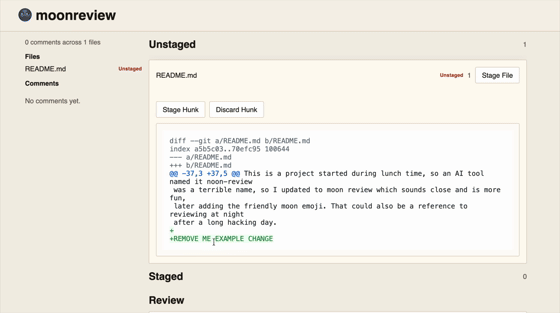

# 🌚 moonreview

The missing local code review step when working with AI agents.



moonreview is a tiny local code review UI for git.

It shows git hunks, lets you comment, stage or unstage them individually. Comments can either be sent to your local claude or codex (using your currently signed-in account) or collected in one big review text for copy pasting in your favourite AI tool.

## Installation

Build from source:

Requirements:

- [Rust](https://www.rust-lang.org/tools/install)
- Node.js with npm

```bash
cargo install --path .
moonreview
```

Source builds require Rust plus the existing Node/npm frontend toolchain used by `build.rs`.

## Easy installation

Install the latest prebuilt binary:

```bash
curl -fsSL https://raw.githubusercontent.com/antoineMoPa/moonreview/main/install.sh | sh
```

If `~/.local/bin` is not already on your `PATH`, you may need to update your PATH in your
shells.

## Usage

```bash
moonreview
```

Run `moonreview` inside any git repository you want to review.

## Stopping the server

```bash
pkill moonreview
```

There is also a timeout after 30 minutes.

## Development

I usually use this as part of my debug loop:

```bash
pkill moon;  cargo install --path . ; moonreview
```

## Origin of name

This is a project started during lunch time, so an AI tool named it noon-review which
was a terrible name, so I updated to moon review which sounds close and is more fun,
later adding the friendly moon emoji. That could also be a reference to reviewing at night
after a long hacking day.
